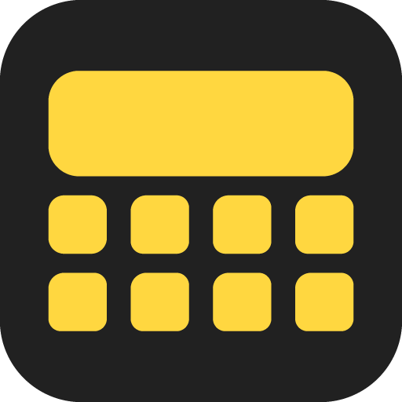
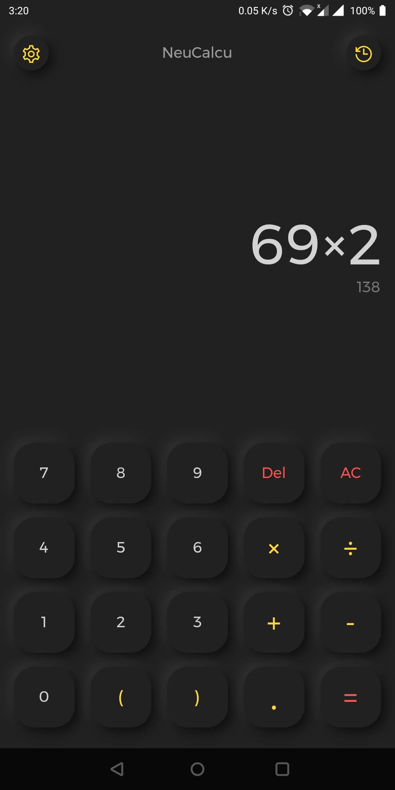
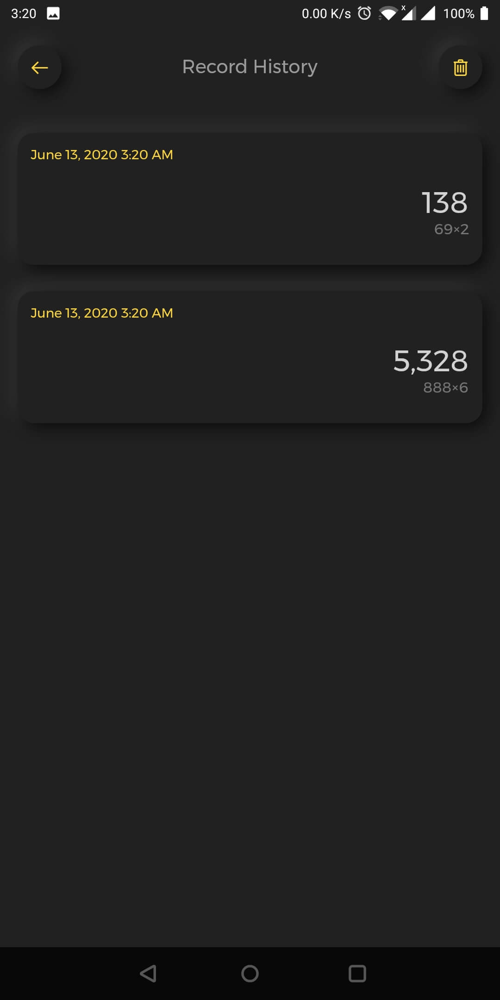
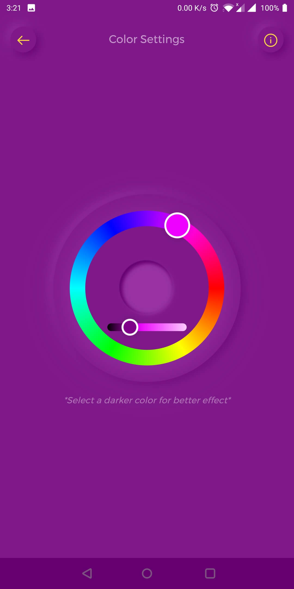
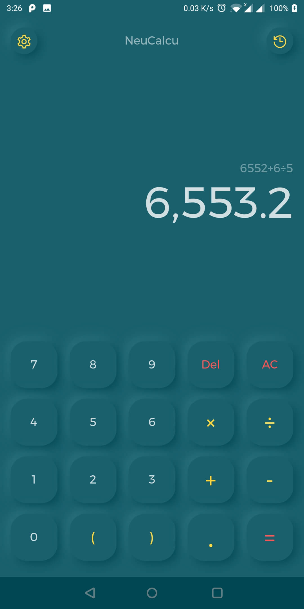
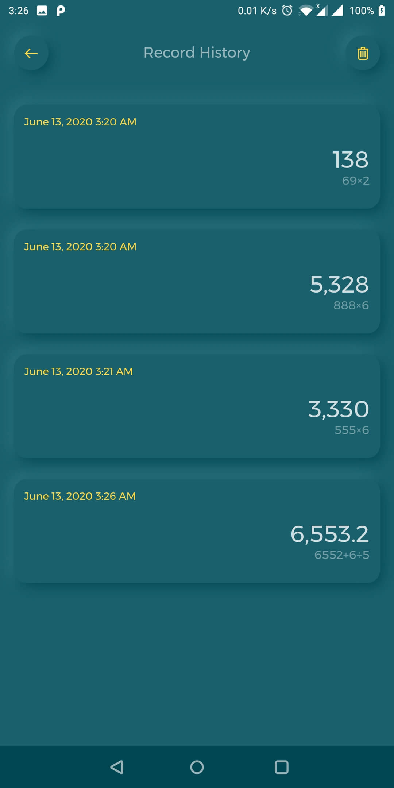

# NeuCalcu

NeuCalcu is a Flutter calculator application that uses Neumorphic Design.

 

## App Features

- Perform basic calculations
- Keep records of user calculation
- Personalized app color

## Screenshots

    
    
